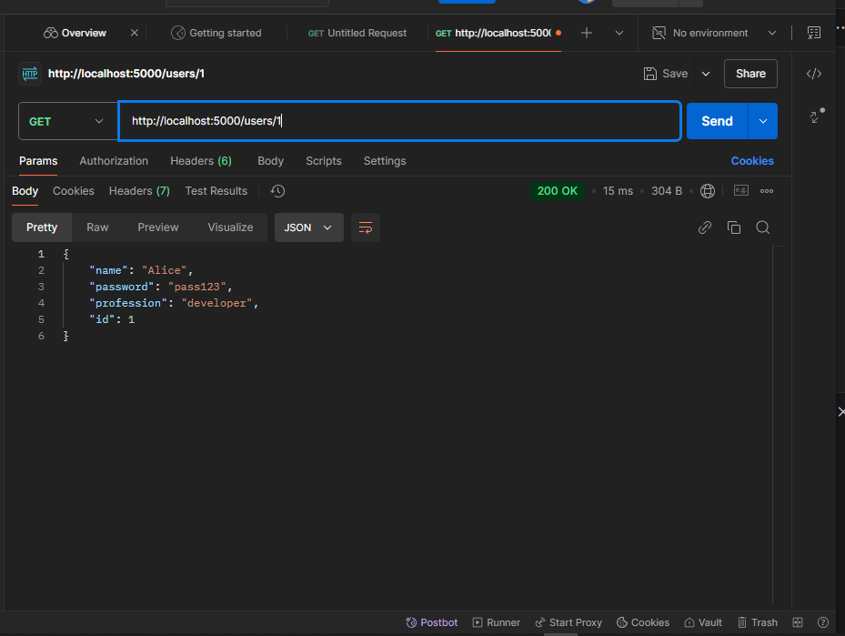

# restfulapi
this is a project using nodejs
# User Information API

## Project Overview

This project is focused on building a simple API that retrieves user information through various GET routes. The API allows users to:

1. Fetch a user by their name.
2. Fetch a user's profession by their ID.
3. Retrieve specific details of a user.
4. Retrieve all users' information.

### Objectives

- Build an API with multiple GET routes to fetch user data.
- Test the functionality of these routes to ensure correct responses.
- Ensure the API returns the correct data for each type of query.

### What I Learned

During this project, I gained experience in building RESTful APIs, handling GET requests, and testing responses. I also learned how to structure API responses properly and handle errors gracefully. The hands-on experience of working with API testing was particularly valuable.

---

## Testing Screenshots

Below are screenshots that demonstrate the API responses for each of the GET routes:

1. **Fetch User by Name**  
   This screenshot shows the response when fetching a user by name.
   

2. **Fetch User's Profession by ID**  
   This screenshot shows the response when fetching a user's profession based on their ID.
   

3. **Fetch Specific User's Details**  
   This screenshot shows the response when retrieving details for a specific user.
   

4. **Fetch All Users**  
   This screenshot shows the response when retrieving all users' information.
   

---

## Discussion

This project provided an excellent opportunity to learn more about building and testing APIs. I enjoyed creating GET routes for different purposes, such as retrieving user details by ID, profession, or name. Each route was tested thoroughly, and the screenshots above show that the API functions as expected.

For group projects, it is useful to divide tasks such as route creation, data handling, and testing. In this case, I focused on building the routes and testing them to ensure correct responses. Working on this project helped me deepen my understanding of API development, particularly in handling GET requests.

---

## Conclusion

By the end of this project, I successfully implemented a functional API with the ability to retrieve specific user information. The project helped me practice both backend development and testing skills in a structured way.

---

